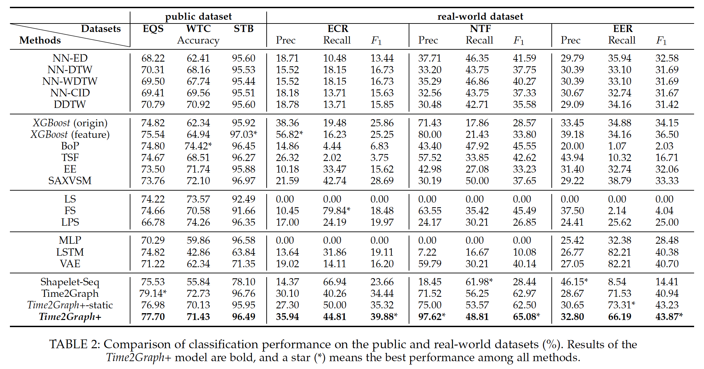
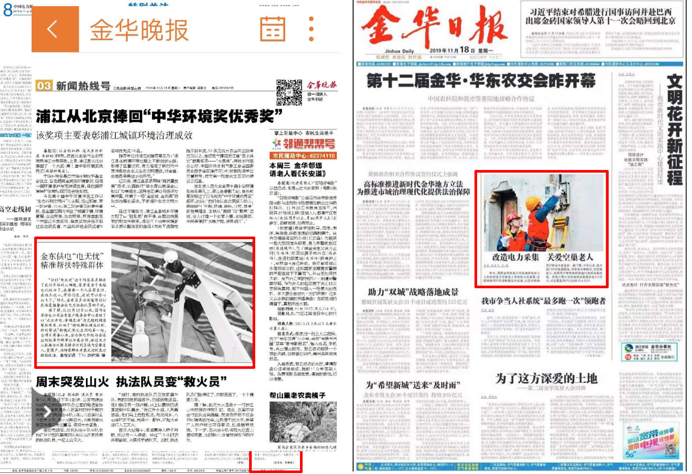

### Introduction

Time series modeling has attracted great research interests in the last decades, while achieving both reliable efficiency and interpretability from a unified model still remains a challenging problem.  Among the literature, **shapelet-based** models aim to extract representative subsequences, and could offer explanatory insights in the downstream tasks. But most of those works ignore the seasonal effects on the subsequences, as well as the evolutionary characteristics of shapelets, which may reflect intrinsic properties of time series itself.

Our previous work, **Time2Graph**[1] in AAAI'2020([Project](https://petecheng.github.io/Time2Graph/)), models the dynamics of shapelets via shapelet evolution graph, and translates the original problem of time series representation learning into graph embedding; while there exist several constraints and limitations which may bring in biaes on modeling shapelet evolutions. So we further propose an end-to-end framework namely **Time2Graph+** by introducing graph attentions on shapelet graphs, and validate the proposed model in a real-world application.

### Intuition: limitations in Time2Graph

There are several limitations on the implementation of Time2Graph:
* L1: In the process of transforming time series data into a shapelet evolution graph, it first conducts segmentations on the original time series, manually assign "similar" shapelets to each segment, and recognizes adjacent appearances of shapelets as "possible transitions". Since we would never know the ground truth of which shapelets should be assigned to each segment, the possible dynamic transitions between adjacent shapelets may be incorrectly counted, and be biased on the observed time series data.
	
* L2: Another disadvantage of the way it constructs the shapelet evolution graph in Time2Graph is that some weak transitions between shapelets might be magnified, since it simply sums up all the counted weighted edges over the entire set of time series, and noisy connections between some pairs of vertices are probably much stronger than they should be after the normalization on edge weights. 
	
* L3: Last but not least, Time2Graph only constructs a uniform shapelet evolution graph from all time series data to extract frequent shapelet transitions, while infrequent ones may reflect unique transition patterns of a time series. After all, the whole framework of constructing the shapelet evolution graph in \timetgraph may bring several biases in learning the shapelet hidden representations, and cause performance drops in the downstream tasks.

### Model: Time2Graph+

To address those potential shortcomings, we propose **Time2Graph+**, an extension of Time2Graph that applies graph attention networks to model the shapelet evolutions. A straightforward intuition here is that,  the shapelet transition probabilities which are reflected by the edge weights can be parameterized by graph attentions, so we are able to **learn** the evolutionary patterns of shapelets rather than approximately counting on adjacent transitions. 

Specifically, instead of constructing a uniform shapelet evolution graph for all time series data, we first transform each time series into a unique unweighted graph (L3), since different sequences may have various evolutionary patterns, i.e., different graph structures; and then apply graph attention mechanisms [2] to automatically capture the transition patterns between shapelets,  by assigning learnable dynamic edge weights which can be naturally interpreted as the shapelet transition probability (L1 and L2). We carefully initialize the graph structure for each time series, and design an end-to-end supervised framework to learn the global attention parameters, by translating the original time series classification problem into the graph-level classification.

Formulations of shapelet extractions with time-level attention can be found in [Time2Graph](https://petecheng.github.io/Time2Graph/),
and the following figure gives an overview of Time2Graph+. More details of the whole framework can be referred in our paper (will be released soon).

     

### Evaluation Results

We conduct time series classification tasks on three public benchmarks datasets from *UCR-Archive* [3] and three real-world datasets from State Grid of China and China Telecom. Experimental results are shown in the following table; and we have also conduct extensive ablation and observational studies to validate our proposed framework. Please see details in our paper.

     

### Application: empty-nest elederly recognition

Last but not least, we have deployed Time2Graph+ model in a real-world application, elderly recognition, cooperated with State Grid of China, Jinhua Zhejiang.
In the real-world scenario of citizens' electricity consuming,  an important issue is that it may be very dangerous for some specific groups of people to use electricity alone at home,  due to their limited behavioral capacity. One such kind of citizens is the empty-nest elderly, since they are old and live alone, usually have difficulty moving conveniently, and once there are emergency cases related with electricity usage, they are probably unable to properly handle with them. A commonly applied solution is to monitor the real-time electricity usage of the elderly,  and if there are any abnormal states among some user's electricity consuming records,  staffs in the State Grid would take corresponding actions as soon as possible, to make sure the safety of the user.

However, in practice only a small part of the empty-nest elderly are recognized in the database, i.e., provided by some government departments during on-site investigations, and staffs almost have no idea about who are the elderly among all other users. Besides, it is very costly and time-consuming to check all users on-site to obtain the labels whether each user is the empty-nest elderly or not. So we deploy our proposed Time2Graph+ model to automatically recognize the empty-nest elderly users in the State Grid Jinhua Power Supply Co. Ltd., a subsidiary of State Grid of China. Our target is to find the elderly as precise as possible given users' electricity consumption records over the past year.

To support some necessary observational studies and the training, validation and evaluation of the model, we need a large pool of labeled users. We first conduct a large-scale on-site questionnaire over 10,000 users who are randomly sampled,  and collect $\sim$6,600+ valid results to tell whether each of them is the empty-nest elderly or not. Finally, there are totally 4,807 users who have continuous electricity-usage records over the past year, and they are split as training and validation sets during the process of our model learning. After that, we again randomly sampled ~800 unlabeled users, among which our Time2Graph+ model predicts 39 samples as the empty-nest elderly. Note that here we increase the classification threshold, i.e., predicting less positive samples (the elderly), since in this real-world application, precision is the more important metric. Then staffs in the State Grid check those 39 users by on-site investigation,  and 25 of them are verified as the elderly, indicating that our model achieves **75.8%** in terms of precision. Our framework has been deployed in the online platform in the State Grid to automatically recognize the empty-nest elderly users, and in the future, a complete electricity-usage-safety monitoring system will be built based on these predicted labels. The following figure shows some reports on this project from local media. 

     

### Reference

[1] Cheng, Z; Yang, Y; Wang, W; Hu, W; Zhuang, Y and Song, G, 2020, Time2Graph: Revisiting Time Series Modeling with Dynamic Shapelets, In AAAI, 2020
[2] P. Veliˇckovi´c, G. Cucurull, A. Casanova, A. Romero, P. Li` o, and Y. Bengio, “Graph attention networks,” in InternationalConference on Learning Representations (ICLR), 2018. [Online](https://openreview.net/forum?id=rJXMpikCZ)
[3] Dau, H. A.; Keogh, E.; Kamgar, K.; Yeh, C.-C. M.; Zhu, Y.; Gharghabi, S.; Ratanamahatana, C. A.; Yanping; Hu, B.; Begum, N.; Bagnall, A.; Mueen, A.; and Batista, G. 2018. The ucr time series classification archive. https://www.cs.ucr.edu/~eamonn/time_series_data_2018/. 